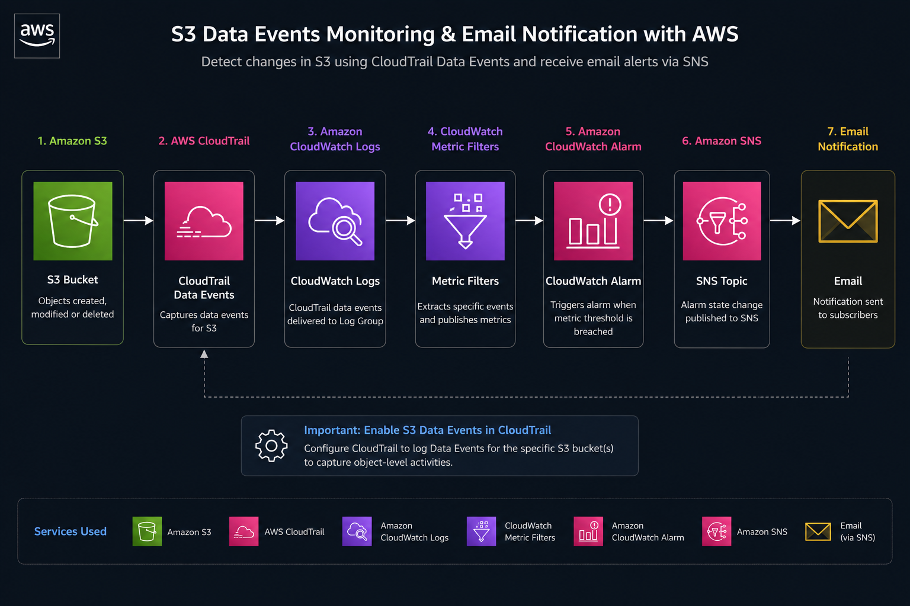

## 🛡️ Auditoría y Monitoreo de Eventos Críticos en Amazon S3

### 📝 Descripción del Proyecto

Arquitectura de auditoría y monitoreo para Amazon S3 orientada a detectar actividades críticas sobre objetos sensibles, generar alertas automáticas y mantener trazabilidad completa entre las notificaciones operativas y los registros de auditoría.

El proyecto evolucionó desde una arquitectura basada en métricas (**CloudTrail + CloudWatch + SNS**) hacia una arquitectura orientada a eventos (**CloudTrail + EventBridge + Lambda + SNS**), permitiendo obtener información más detallada de cada operación realizada sobre el bucket auditado.

---

## 🚀 Evolución del Proyecto

### 🔹 Versión 1.0 — Monitoreo basado en métricas

Capacidades:

* Registro de eventos mediante CloudTrail.
* Generación de métricas mediante Metric Filters.
* Alarmas automáticas en CloudWatch.
* Notificaciones vía SNS.

Limitaciones encontradas:

* Las alertas no mostraban información detallada del recurso afectado.
* Difícil correlación entre la notificación y la evidencia de auditoría.
* Monitoreo centrado en métricas y no en eventos específicos.

* [`Verificar version 1.0`](https://github.com/BrayanR03/Proyecto-Auditoria-AWS/blob/main/documentation/project-auditoria-aws.md)

---

### 🔹 Versión 2.0 — Arquitectura Event-Driven

Mejoras implementadas:

* Procesamiento de eventos en tiempo real.
* Identificación del bucket y objeto afectado.
* Captura del tipo de operación realizada.
* Inclusión del Request ID para trazabilidad.
* Correlación entre notificaciones y registros CloudTrail.
* Notificaciones enriquecidas para auditoría y seguridad.

* [`Verificar version 2.0`](https://github.com/BrayanR03/Proyecto-Auditoria-AWS/blob/main/documentation/project-auditoria-aws-v2.md)

---

### 🎯 Objetivo

Detectar automáticamente operaciones sensibles realizadas sobre objetos dentro de un bucket Amazon S3 y notificar eventos críticos hacia los responsables de seguridad o infraestructura, manteniendo trazabilidad completa con los registros de auditoría generados por CloudTrail.

---

### 🧠 Caso de Uso

El proyecto simula un entorno donde una organización almacena información crítica dentro de Amazon S3.

Cada vez que se realiza una operación sensible sobre un objeto, la arquitectura:

* Detecta el evento.
* Genera evidencia de auditoría mediante CloudTrail.
* Procesa el evento mediante EventBridge y Lambda.
* Envía una notificación detallada vía SNS.
* Permite correlacionar la alerta recibida con el registro exacto almacenado en CloudTrail.

---

### ☁️ Servicios AWS Utilizados

* Amazon S3
* AWS CloudTrail
* Amazon EventBridge
* AWS Lambda
* Amazon SNS
* Amazon CloudWatch
* IAM

---

### 🔍 Eventos Monitoreados

* PutObject
* DeleteObject

---

### 🚀 Funcionalidades

* Auditoría Object-Level sobre Amazon S3.
* Registro de Data Events mediante CloudTrail.
* Procesamiento de eventos en tiempo real.
* Correlación mediante Request ID.
* Notificaciones enriquecidas vía SNS.
* Arquitectura orientada a eventos (Event-Driven).
* Trazabilidad entre monitoreo y auditoría.

---

### 🧑‍💻 Sobre Mí

Brayan Neciosup Bolaños - Data & Cloud Engineer Jr.

Actualmente explorando **Infraestructura como Código** y su potencial para el despliegue de recursos en AWS.

📫 **Contacto**  
- 🌐 Portafolio: [Portafolio_WIX](https://bryanneciosup626.wixsite.com/brayandataanalitics)  
- 💼 LinkedIn: [linkedin.com/in/brayanneciosup](https://www.linkedin.com/in/brayan-rafael-neciosup-bola%C3%B1os-407a59246/)  
- 🧠 GitHub: [github.com/brayanneciosup](https://github.com/BrayanR03)  
- ✉️ Email: [bryanneciosup626@gmail.com](bryanneciosup626@gmail.com)
